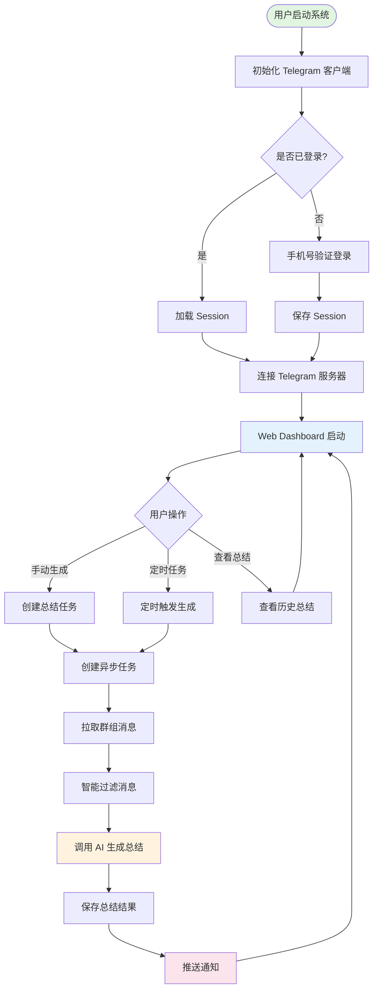
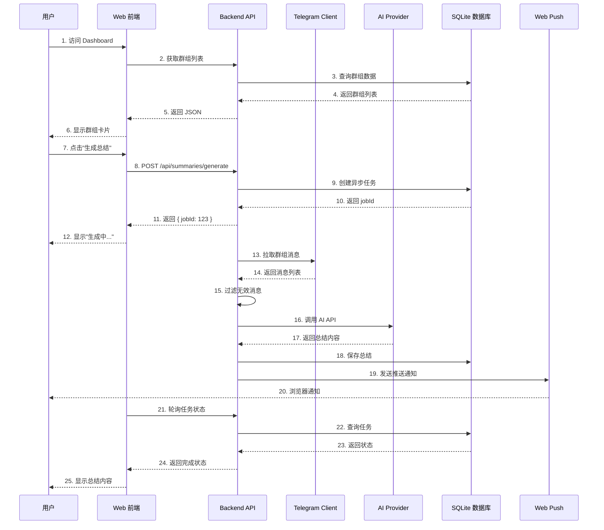
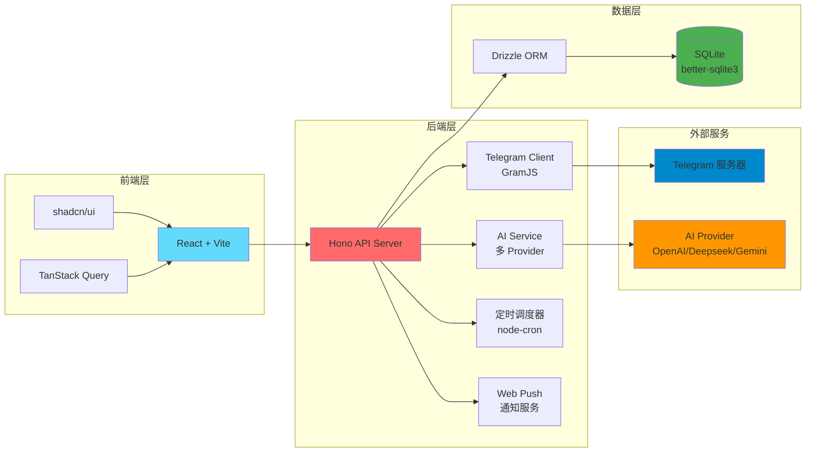

# Omniknight - Telegram 群组 AI 总结系统

> 🤖 自动监听 Telegram 群组消息,使用 AI 定期生成高质量的结构化总结,并在 Web Dashboard 上聚合展示。

## 特性

- ✅ **按需拉取消息** - 使用 GramJS Userbot 拉取任意已加入群组的历史消息
- ✅ **智能过滤** - 自动过滤无价值消息(短消息、纯表情、广告等)
- ✅ **多 AI 支持** - 支持 Mock、OpenAI、Deepseek、Gemini 等
- ✅ **异步任务** - 后台生成总结,实时进度反馈
- ✅ **定时调度** - 按群组配置自动定期生成总结
- ✅ **Web Dashboard** - React 前端,可视化查看总结和管理群组
- ✅ **浏览器推送通知** - 任务完成/失败时通过 Web Push 推送通知,即使浏览器在后台也能收到

## 系统运行原理

### 核心流程图



### 数据流向图



### 技术架构图



## 快速开始（Step by Step）

### 前置要求

- ✅ Node.js v24 或更高版本
- ✅ pnpm 包管理器
- ✅ Telegram 账号（建议使用测试小号）
- ✅ AI API Key（Deepseek/OpenAI/Gemini 任选其一）

### 步骤 1: 克隆项目并安装依赖

```bash
# 克隆项目
git clone <your-repo-url>
cd omniknight

# 安装依赖（使用 pnpm）
pnpm install
```

### 步骤 2: 获取 Telegram API 凭证

1. 访问 [https://my.telegram.org](https://my.telegram.org)
2. 使用你的 Telegram 账号登录
3. 点击 "API development tools"
4. 填写应用信息（随意填写即可）
5. 获取 `api_id` 和 `api_hash`

> ⚠️ **重要提示**: 建议使用测试小号，避免主号被封风险

### 步骤 3: 获取 AI API Key

选择以下任一 AI 服务商：

#### 方案 A: Deepseek（推荐，性价比高）
1. 访问 [https://platform.deepseek.com](https://platform.deepseek.com)
2. 注册并登录
3. 创建 API Key
4. 记录 API Key（格式：`sk-xxxxx`）

#### 方案 B: OpenAI
1. 访问 [https://platform.openai.com](https://platform.openai.com)
2. 创建 API Key
3. 记录 API Key

#### 方案 C: Google Gemini
1. 访问 [https://aistudio.google.com/app/apikey](https://aistudio.google.com/app/apikey)
2. 创建 API Key
3. 记录 API Key

### 步骤 4: 配置环境变量

```bash
# 复制环境变量模板
cp apps/backend/.env.example apps/backend/.env

# 编辑配置文件
nano apps/backend/.env  # 或使用你喜欢的编辑器
```

#### 必需配置项

```bash
# ========================================
# 服务器配置
# ========================================
PORT=3000
NODE_ENV=development

# ========================================
# 数据库配置
# ========================================
DATABASE_PATH=./data/db.sqlite

# ========================================
# Telegram API 配置（步骤 2 获取）
# ========================================
TELEGRAM_API_ID=12345678              # 替换为你的 api_id
TELEGRAM_API_HASH=abcdef1234567890    # 替换为你的 api_hash

# ========================================
# AI Provider 配置（步骤 3 获取）
# ========================================
AI_PROVIDER=deepseek                  # 可选: mock | openai | deepseek | gemini

# 如果使用 Deepseek
AI_API_KEY=sk-xxxxxxxxxxxxx           # 替换为你的 Deepseek API Key
AI_API_BASE_URL=https://api.deepseek.com/v1
AI_MODEL=deepseek-chat

# 如果使用 OpenAI
# AI_PROVIDER=openai
# AI_API_KEY=sk-xxxxxxxxxxxxx
# AI_API_BASE_URL=https://api.openai.com/v1
# AI_MODEL=gpt-4o-mini

# 如果使用 Gemini
# AI_PROVIDER=gemini
# GEMINI_API_KEY=AIzaSyxxxxxxxxxxxxx
# AI_MODEL=gemini-2.5-flash
```

#### 可选配置项（Web Push 浏览器推送通知）

```bash
# 生成 VAPID 密钥对
cd apps/backend
pnpm exec web-push generate-vapid-keys --json

# 将输出的密钥添加到 .env
VAPID_PUBLIC_KEY=BNxxxxxxxxxxxxxx
VAPID_PRIVATE_KEY=xxxxxxxxxxxxxx
VAPID_SUBJECT=mailto:your-email@example.com
```

### 步骤 5: 启动服务

#### 方式 A: 同时启动前后端（推荐）

```bash
# 在项目根目录执行
pnpm dev
```

服务地址：
- 后端 API: [http://localhost:3000](http://localhost:3000)
- 前端 Dashboard: [http://localhost:5173](http://localhost:5173)

#### 方式 B: 分别启动（用于调试）

**终端 1 - 启动后端**:
```bash
pnpm --filter @omniknight/backend dev
# 后端运行在 http://localhost:3000
```

**终端 2 - 启动前端**:
```bash
pnpm --filter @omniknight/web dev
# 前端运行在 http://localhost:5173
```

### 步骤 6: 添加 Telegram 账号

启动服务后，通过 Web Dashboard 添加 Telegram 账号：

1. **打开浏览器**，访问 [http://localhost:5173](http://localhost:5173)

2. **进入账号管理页面**
   - 点击顶部导航栏的 **"账号管理"** 标签页

3. **点击添加账号按钮**
   - 点击页面右上角的 **"添加新账号"** 按钮（蓝色按钮，带 + 图标）

4. **步骤 1/3：输入手机号**
   - 在弹出的对话框中输入你的 Telegram 手机号
   - 格式：`+86 13800138000`（必须带国际区号）
   - 点击 **"发送验证码"** 按钮

5. **步骤 2/3：输入验证码**
   - 打开 Telegram 应用，查看收到的验证码
   - 在对话框中输入验证码（5位数字）
   - 点击 **"验证"** 按钮

6. **步骤 3/3：输入两步验证密码（如果需要）**
   - 如果你的账号启用了两步验证，会提示输入密码
   - 输入你的两步验证密码
   - 点击 **"完成"** 按钮

7. **添加成功**
   - 看到 "账号添加成功！" 提示
   - 账号列表中会显示新添加的账号，状态为 **"在线"**

> 💡 **提示**:
> - Session 会自动保存到数据库，下次启动无需重新登录
> - 建议使用测试小号，避免主号被封风险
> - 可以添加多个账号，每个账号可以监听不同的群组

### 步骤 7: 添加要监听的群组

添加账号后，需要选择要监听的 Telegram 群组：

1. **进入群组管理页面**
   - 点击顶部导航栏的 **"群组管理"** 标签页

2. **点击添加群组按钮**
   - 点击页面右上角的 **"添加新群组/话题"** 按钮（蓝色按钮）

3. **步骤 1/2：选择账号**
   - 在弹出的对话框中，选择要使用的 Telegram 账号
   - 点击对应的账号卡片

4. **步骤 2/2：选择群组**
   - 系统会自动加载该账号加入的所有群组
   - 勾选要监听的群组（可多选）
   - 如果是 **Forum 类型群组**（带话题功能）：
     - 点击群组前的 **▶** 展开话题列表
     - 勾选要监听的具体话题
   - 点击 **"确认添加"** 按钮

5. **配置群组参数（可选）**
   - 在群组列表中，点击账号前的 **▼** 展开该账号的群组
   - 找到刚添加的群组，点击 **"编辑"** 按钮
   - 可配置：
     - **总结间隔**：每隔多少小时自动生成总结（1-24小时）
     - **最少消息数**：至少多少条消息才生成总结（避免无意义总结）
     - **自定义提示词**：自定义 AI 总结的风格和重点
   - 点击 **"保存"** 按钮

> 💡 **提示**:
> - 可以随时添加或删除群组
> - 每个群组可以独立配置总结参数
> - Forum 群组可以按话题单独监听和总结

### 步骤 8: 使用 Web Dashboard

#### 8.1 生成总结

**手动生成总结**：

1. **进入群组管理页面**
   - 点击顶部导航栏的 **"群组管理"** 标签页

2. **展开账号**
   - 点击账号前的 **▼** 展开该账号的群组列表

3. **生成总结**
   - 找到要生成总结的群组
   - 点击群组右侧的 **"生成总结"** 按钮（蓝色按钮）
   - 系统会自动根据群组配置的时间间隔拉取消息并生成总结

4. **查看任务进度**
   - 点击后会自动跳转到 **"任务"** 标签页
   - 可以看到任务的实时进度：
     - 🔄 **进行中**：正在拉取消息或调用 AI
     - ✅ **已完成**：总结生成成功
     - ❌ **失败**：显示错误信息
   - 点击任务可以查看详细日志

5. **查看总结内容**
   - 任务完成后，点击顶部导航栏的 **"总结列表"** 标签页
   - 可以看到所有生成的总结
   - 点击总结卡片查看完整内容

**自动定时生成**（可选）：

- 在群组配置中设置 **"总结间隔"**（如每 6 小时）
- 系统会自动在后台定时生成总结
- 无需手动操作

#### 8.2 查看总结历史

1. **进入总结列表页面**
   - 点击顶部导航栏的 **"总结列表"** 标签页（首页）

2. **浏览总结**
   - 总结按时间倒序排列（最新的在最上面）
   - 每个总结卡片显示：
     - 群组名称
     - 生成时间
     - 消息数量
     - 总结内容预览

3. **筛选总结**
   - 可以按群组筛选
   - 可以按时间范围筛选

#### 8.3 启用浏览器推送通知（可选）

如果你配置了 Web Push（步骤 4 的可选配置），可以启用浏览器通知：

1. **进入设置页面**
   - 点击顶部导航栏的 **"设置"** 标签页

2. **启用通知**
   - 找到 **"浏览器推送通知"** 部分
   - 点击 **"启用通知"** 按钮
   - 浏览器会弹出权限请求，点击 **"允许"**

3. **接收通知**
   - 任务完成后，即使浏览器在后台，也会收到推送通知
   - 点击通知可以直接跳转到任务详情

#### 8.4 管理账号和群组

**暂停/启用群组**：
- 在 **"群组管理"** 页面，点击群组的 **"暂停"** 按钮
- 暂停后不会自动生成总结，但可以手动生成

**删除群组**：
- 在 **"群组管理"** 页面，点击群组的 **"删除"** 按钮
- 会删除该群组的所有历史总结

**禁用/启用账号**：
- 在 **"账号管理"** 页面，点击账号的 **"禁用"** 按钮
- 禁用后该账号的所有群组都会停止监听

**删除账号**：
- 在 **"账号管理"** 页面，点击账号的 **"删除"** 按钮
- 会删除该账号关联的所有群组和总结

### 步骤 9: 验证系统运行

#### 测试 API 连接

```bash
# 查看账号列表
curl http://localhost:3000/api/accounts

# 查看群组列表
curl http://localhost:3000/api/groups

# 手动生成总结
curl -X POST http://localhost:3000/api/summaries/generate \
  -H "Content-Type: application/json" \
  -d '{
    "groupId": 1,
    "periodStart": "2025-01-29T00:00:00Z",
    "periodEnd": "2025-01-30T23:59:59Z"
  }'

# 查询任务状态（替换 123 为实际 jobId）
curl http://localhost:3000/api/summaries/jobs/123
```

#### 查看日志

```bash
# 后端日志会实时输出到终端
# 关键日志包括：
# - 🚀 Telegram 账号管理器启动
# - 🔌 按需连接账号
# - 📡 开始拉取消息
# - 🤖 调用 AI 生成总结
# - ✅ 总结生成完成
# - 🔔 推送通知已发送
```

#### 常见问题排查

**问题 1：账号添加失败**
- 检查 `TELEGRAM_API_ID` 和 `TELEGRAM_API_HASH` 是否正确
- 确认手机号格式正确（带国际区号）
- 查看后端日志的错误信息

**问题 2：群组列表为空**
- 确认账号已成功添加且状态为 "在线"
- 检查该账号是否真的加入了 Telegram 群组
- 尝试在 Telegram 应用中刷新群组列表

**问题 3：总结生成失败**
- 检查 AI API Key 是否正确配置
- 确认 AI Provider 配置正确（deepseek/openai/gemini）
- 查看任务详情中的错误日志
- 检查群组消息数量是否达到最少消息数要求

**问题 4：浏览器通知不工作**
- 确认已配置 VAPID 密钥
- 检查浏览器是否允许通知权限
- 确认使用的是 HTTPS 或 localhost（HTTP 不支持 Web Push）

## 导航栏说明

Web Dashboard 顶部有 5 个标签页：

1. **总结列表**（首页）
   - 查看所有生成的总结
   - 按时间倒序排列
   - 支持筛选和搜索

2. **群组管理**
   - 添加/删除监听的群组
   - 配置总结参数（间隔、最少消息数、自定义提示词）
   - 手动生成总结
   - 暂停/启用群组

3. **账号管理**
   - 添加/删除 Telegram 账号
   - 查看账号连接状态
   - 禁用/启用账号
   - 查看每个账号关联的群组数量

4. **任务**
   - 查看所有总结生成任务
   - 实时显示任务进度
   - 查看任务详细日志
   - 任务状态：进行中、已完成、失败

5. **设置**
   - 配置浏览器推送通知
   - 系统全局配置
   - 过滤规则配置

## 常用命令

```bash
# 开发
pnpm dev                          # 启动所有服务
pnpm --filter @omniknight/backend dev   # 仅启动后端
pnpm --filter @omniknight/web dev       # 仅启动前端

# 停止服务
pnpm stop                         # 停止所有
pnpm stop:backend                 # 停止后端
pnpm stop:web                     # 停止前端

# 数据库
pnpm db:studio                    # 打开 Drizzle Studio
pnpm db:push                      # 推送 schema 变更

# 代码质量
pnpm format                       # 格式化代码
pnpm check                        # 检查代码

# 构建
pnpm build                        # 构建所有包
```

## API 示例

### 查看群组列表

```bash
curl http://localhost:3000/api/groups
```

### 手动生成总结 (异步)

```bash
curl -X POST http://localhost:3000/api/summaries/generate \
  -H "Content-Type: application/json" \
  -d '{
    "groupId": 1,
    "periodStart": "2025-12-14T00:00:00Z",
    "periodEnd": "2025-12-14T23:59:59Z"
  }'

# 返回: { "data": { "jobId": 123 } }
```

### 查询任务状态

```bash
curl http://localhost:3000/api/summaries/jobs/123
```

### 查看总结列表

```bash
curl "http://localhost:3000/api/summaries?groupId=1&limit=10"
```

## 技术栈

- **Monorepo**: Turborepo + pnpm
- **后端**: Node.js v24, Hono, Drizzle ORM, GramJS
- **数据库**: SQLite (better-sqlite3)
- **AI**: OpenAI 兼容 API (Deepseek/GPT-4o/Gemini)
- **前端**: React 18 + Vite, shadcn/ui, TanStack Query

## 项目结构

```
omniknight/
├── apps/
│   ├── backend/           # 后端服务
│   └── web/               # 前端应用
├── packages/
│   ├── db/                # 数据库 Schema
│   └── shared/            # 共享类型
└── docs/                  # 文档
    ├── 实现详解.md        # 完整的技术实现讲解
    └── 前端任务监控实现总结.md
```

## 文档

- [实现详解](./docs/实现详解.md) - 完整的系统架构和技术实现讲解
- [前端任务监控实现总结](./docs/前端任务监控实现总结.md) - 前端任务监控功能详解

## 重要提示

### Telegram Userbot 风险

- ⚠️ **使用测试账号**: 强烈建议使用小号进行开发
- ⚠️ **可能违反 ToS**: Userbot 可能违反 Telegram 服务条款
- ⚠️ **封号风险**: 频繁操作可能导致账号被封
- ✅ **限流保护**: 系统内置自适应限流,降低风险

### 为什么使用 Userbot?

官方 Bot API 限制:
- ❌ 无法读取非管理员群组的历史消息
- ❌ 只能接收加入后的新消息

Userbot (GramJS) 优势:
- ✅ 可以拉取任何已加入群组的历史消息
- ✅ 无需管理员权限
- ✅ 完整的 TypeScript 支持

## License

MIT

---

**注意**: 本项目仅供学习和个人使用。使用 Telegram Userbot 需遵守 Telegram 服务条款,请谨慎使用。
